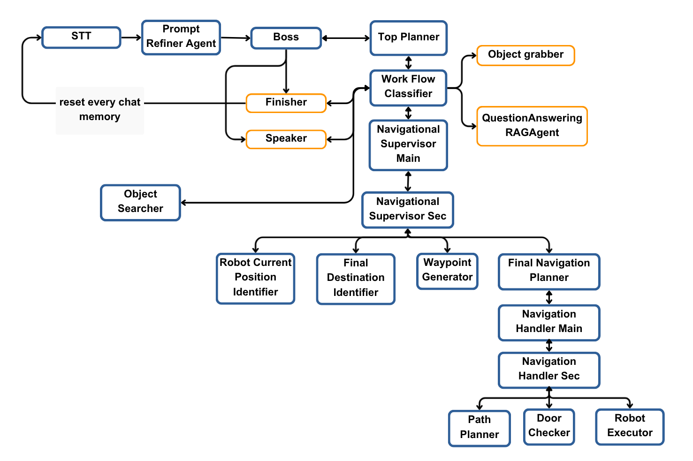

# mas-llm-robotics-eval

Evaluation harness, scenarios, results, and scoring scripts for the
proposed Hierarchical Multi-Agentic System (MAS) for LLM-driven
autonomous problem-solving in robotics. The system source code, both
baselines, the per-agent prompts, the Webots world, and the TCP/JSON
bridge live in the companion repository
[mas-llm-robotics](https://github.com/kugesan1105/mas-llm-robotics).

## System overview

The proposed Hierarchical MAS organises specialised agents into three
layers. The **interpretation layer** parses the user command into a
strategic plan. The **supervisory layer** decomposes the plan into
sub-tasks and handles errors escalated from the layer below. The
**execution-and-perception layer** interfaces with the robot and reports
perception events upward. When an execution-layer failure occurs (e.g.,
an unexpectedly closed door), it is propagated upward with the full
mission context, allowing the supervisory layer to re-invoke the
strategic planner under the updated environmental state rather than
abort.



## Comparative evaluation

Three systems were evaluated on the same 20-scenario benchmark under
identical conditions (Pioneer 3-AT robot, RRT motion planner, GPT-4o
backbone for the LLM-driven systems, scenario-supplied door states).

| Metric | Rule-Based | Non-Agentic LLM | MAS |
|---|---:|---:|---:|
| Success Rate (SR) | 65.0 % | 70.0 % | **90.0 %** |
| Goal-Conditions Recall (GCR) | 76.7 % | 80.0 % | **83.3 %** |
| Executability (Exec) | 100 % | 100 % | 100 % |
| Hallucinated confirmations | **0** | 5 | **0** |

## Metrics

- **Success Rate (SR)** — fraction of scenarios in which every
  goal-condition is satisfied. SR is the strictest measure: a scenario
  counts as a success only if all of its predicates are met. The metric
  follows the goal-conditions formalism of VirtualHome (Puig et al.,
  CVPR 2018) and ProgPrompt (Singh et al., ICRA 2023).

- **Goal-Conditions Recall (GCR)** — fraction of all goal-condition
  predicates satisfied across the benchmark. Each scenario contributes
  one to three predicates depending on task type (negative/refusal:
  one; information/guidance: one; object-search-and-report: two;
  object-retrieve: three). GCR gives partial credit when only some
  predicates of a scenario are met. Following the same convention as
  ProgPrompt and VirtualHome.

- **Executability (Exec)** — of all the actions each system generated
  across the 20 scenarios, the fraction that were syntactically valid
  and in the robot's action vocabulary. This is a sanity check on
  whether the generated plans can even be attempted by the robot, again
  following the convention used in prior LLM-planning work
  (ProgPrompt, SayCan, Text2Motion, NavGPT).

- **Hallucinated confirmations** — count of user-facing statements
  emitted by the system that contradict the ground-truth world state of
  the scenario (e.g., reporting that the hammer was retrieved when the
  hammer was not present). This is a categorical failure separate from
  SR: a system can fail SR by simply not completing the task, or it
  can fail SR *and* mislead the user with an incorrect statement. The
  hallucination column counts the latter.

## Documentation

Four documents in [`docs/`](docs/), corresponding to the four
sub-evaluations performed in the manuscript:

- [`docs/end_to_end.md`](docs/end_to_end.md) — the 20-scenario
  end-to-end stress test in Webots.
- [`docs/waypoint_accuracy.md`](docs/waypoint_accuracy.md) — adaptive
  path-planning accuracy on the physical hardware platform.
- [`docs/temporal_efficiency.md`](docs/temporal_efficiency.md) —
  temporal-efficiency benchmarking in simulation.
- [`docs/comparative_evaluation.md`](docs/comparative_evaluation.md) —
  the controlled comparison of the proposed MAS against a rule-based
  replanner and a non-agentic LLM planner. Includes the predicate-level
  grading rubric, the per-(system, scenario) score tables, and the
  explanation of why the MAS's GCR sits slightly below its SR.

## Reproducing the numbers

The 5-second flow re-aggregates the canonical per-scenario logs in
[`results/`](results/) without running Webots, the LLM, or anything
else; it just verifies that the saved logs agree with the canonical
aggregate.

```bash
git clone https://github.com/kugesan1105/mas-llm-robotics-eval
cd mas-llm-robotics-eval
python scripts/replay_grade.py --verify-jsons
```

## License

MIT — see [`LICENSE`](LICENSE).
